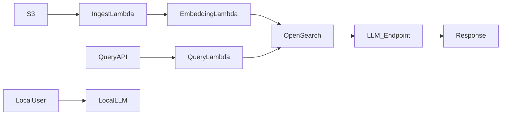

# Executive Summary

We propose a **hybrid cloud-local RAG system** combining AWS-managed services and an on-prem/mobile LLM fallback. In AWS, documents are ingested (via S3/Lambda or SageMaker pipelines), chunked, embedded, and indexed in a vector store (options include Amazon Kendra, OpenSearch, Aurora+pgvector, MemoryDB, etc).  At query time, a user’s question is embedded and used to retrieve top‑K relevant context from the vector store, which is then appended to the prompt for a large language model (LLM) such as an Amazon Bedrock or SageMaker-hosted model. A local lightweight LLM (quantized model on GPU/CPU) can handle private/offline queries or serve as a fast fallback if cloud latency is too high. 

Key AWS components include **Amazon S3** (data/storage), **Lambda** or **Step Functions** (pipeline orchestration), **Amazon OpenSearch Service** (or Kendra/MemoryDB/Aurora) for vector indexing/search, **Amazon Bedrock** or **SageMaker** for LLM inference, and standard services (API Gateway, VPC, IAM, CloudWatch). We leverage **Infra-as-Code** (CloudFormation/Terraform/CDK) and **CI/CD** (CodePipeline/CodeBuild) for repeatability. Autoscaling (on EC2/ECS/Serverless), Spot Instances or Savings Plans, and serverless components cut costs.  

The RAG pipeline involves *document ingestion → text extraction → chunking → embedding (via an embedding model) → vector index*. On query: *text embedding → KNN search → context retrieval → prompt assembly → LLM inference → response*. We address freshness (incremental indexing), caching (Redis/MemoryDB) and hybrid search (semantic + keyword). 

Local LLMs (quantized Llama2, Mistral, etc.) run on on-prem GPUs/CPUs for privacy and low-latency. They fall back to the cloud LLM when needed (e.g. insufficient context or heavy queries).  

We compare vector DB options (AWS vs open-source) and compute options (serverless vs containers vs dedicated), including cost/latency trade-offs (see tables below). We conclude with a **minimal viable architecture** and phased deployment plan, plus rough cost scenarios (low/medium/high usage). 

**Assumptions:** We assume moderate data volume (100K–1M documents, ~GBs of text), moderate query load (thousands per day, occasional peaks), a desire for low-latency (sub-second) responses, and a balanced budget where cost matters but performance/SLOs are important. Security (VPC, encryption, IAM) and monitoring are required. 

# Architecture & Components 

```mermaid
flowchart LR
    subgraph Ingestion
        A[S3 Bucket (Raw Data)] --> B[Lambda / SageMaker Processing] 
        B --> C[Lambda: Chunk & Embed]
        C --> D[(Vector DB / Search Index)]
    end
    subgraph Query
        U(User or App) --> API[API Gateway / App Gateway]
        API --> Q[Lambda: Query Embed]
        Q --> D
        D --> R[Retriever (e.g. KNN search)]
        R --> H[LLM (Bedrock/SageMaker)]
        H --> Response[Formatted Answer]
    end
    subgraph LocalLLM
        U --> LLM_loc[Local LLM (Edge Server/Mobile)]
    end
    click D "https://docs.aws.amazon.com/prescriptive-guidance/latest/choosing-an-aws-vector-database-for-rag-use-cases/vector-db-comparison.html" "AWS Vector DB Options"
    click H "https://aws.amazon.com/what-is/retrieval-augmented-generation/" "AWS RAG Overview"
    click C "https://aws.amazon.com/blogs/machine-learning/build-powerful-rag-pipelines-with-llamaindex-and-amazon-bedrock/" "RAG pipeline (LlamaIndex)"
```

The **ingestion pipeline** pulls data from sources (e.g. S3, databases) into a normalized store, extracts text (using AWS Textract or custom parsers), splits it into chunks (overlapping windows), and converts each chunk into an embedding (vector). These vectors are stored in a **vector database** with metadata. AWS options include:
- **Amazon Kendra** (fully managed enterprise search with built-in connectors; handles ingestion and indexing; latency ~sub-second).  
- **Amazon OpenSearch Service (with k-NN)** (self-managed cluster or serverless, using HNSW/IVF indexes; sub-10ms queries on GPUs; fully controlled but more ops overhead).  
- **Amazon Aurora PostgreSQL + pgvector** (relational DB with vector extension; supports SQL joins + ANN search; tens-hundreds of ms).  
- **Amazon MemoryDB (Redis)** (in-memory store; ultra-low latency (<1ms), up to millions QPS; high memory cost; also usable as a cache).  
- **Amazon DocumentDB (MongoDB)** with vector search (fully managed JSON DB + vectors; ms latency).  
- **Amazon S3 Object Vectors** (new serverless vector on S3; very high scale for infrequent queries).  
- **Graph DB (Neptune Analytics)** for GraphRAG (vector search within graph traversals).  
- **Third-party managed DB**: Pinecone (pods with filtering, live index; usage-based pricing), MongoDB Atlas (with vector search, scale independently), Weaviate (open-source hybrid search on AWS). 
- **Open-source self-host**: Qdrant, Milvus, or Faiss indexes on EC2 (lowest license cost but must manage EC2/EKS/containers).

The **query pipeline** runs on demand. A user query goes through an API (e.g. API Gateway or Application Load Balancer) to a compute service (Lambda or container) that embeds the query text using the same model. The query vector is used to perform a K-nearest-neighbor search in the vector DB, retrieving top-$k$ relevant document chunks. Those chunks’ text are appended to the prompt which is sent to an LLM. The LLM (hosted on Bedrock or SageMaker endpoint) generates a response grounded in the retrieved context. 

Optionally, the **retriever logic** can be more advanced: for example, use keyword filters or hybrid search to narrow candidates, or decompose queries (router/split) using libraries like LlamaIndex or LangChain. AWS suggests using **LangChain on Lambda** to coordinate queries with Kendra/OpenSearch and Bedrock.  

**Local LLM** integration: A quantized LLM (e.g. Llama2, Mistral) runs on a private server or even edge device. For privacy or low-latency, queries first hit the local LLM. If confidence is low or offline knowledge needed, it calls back to the cloud pipeline. This hybrid strategy combines **on-device speed and data privacy** with the cloud’s up-to-date knowledge. The local LLM inference pipeline may use frameworks like HuggingFace Transformers or ONNX Runtime, with GPU or CPU optimized kernels (e.g. NVIDIA TensorRT, Apple CoreML), and supports 4-bit/8-bit quantization to reduce RAM. The local model caches recent queries/answers (in local Redis) to avoid repeat cloud calls. (No citation – this is a design overview.)

**Orchestration & CI/CD:** We recommend **AWS Step Functions** or **Amazon Managed Workflows for Apache Airflow** to sequence the ingestion steps reliably. All infrastructure (VPCs, EC2/ECS, Lambdas, databases, IAM roles, etc.) should be defined via **Infrastructure as Code** (AWS CloudFormation, CDK, or Terraform) for repeatability. Versioned data pipelines, model artifacts, and code can be managed through AWS CodeCommit/CodePipeline or GitHub Actions, with AWS CodeBuild/CodeDeploy for deployments. 

**Monitoring & Logging:** Use AWS **CloudWatch** for logs/metrics, **X-Ray** for tracing requests (API→Lambda→DB→LLM), and **CloudTrail** for auditing API calls. Set CloudWatch Alarms on error rates and latency. Use **Amazon EventBridge** or Lambda for automated remediation (e.g. scaling or retries). 

**Security:** Place compute (Lambda, containers) in a VPC (with private subnets) and use **VPC Endpoints** for S3/Dynamo/Kendra so data never leaves the AWS network. Use AWS **IAM** roles with least privilege for each service (e.g. Lambda roles only allow reading/writing to S3 and the vector DB). Encrypt data at rest (S3 with SSE-KMS, DB with KMS, EBS volumes) and in transit (TLS for all endpoints). Use **AWS WAF** on the API Gateway to block malicious requests, and **AWS Shield/GuardDuty** for DDoS detection. Store secrets (DB credentials, API keys) in AWS **Secrets Manager** or **Parameter Store**. 

**Failure Modes:** The system should handle failures gracefully. For example, if the vector database is temporarily unavailable, the Lambda can retry or fallback to a simpler keyword search (Elasticsearch). If the LLM endpoint fails or exceeds latency SLO, return partial answer or “service unavailable.” Use Dead-Letter Queues for ingestion Lambda errors, and set concurrency limits on Lambda to avoid overloaded DB. Regular backups of the vector store (snapshots) ensure durability. 

# RAG Pipeline Choices

- **Ingestion:** Data can come from S3, databases, or streams. For static corpora (documents, wikis), batch ingestion via S3 triggers and AWS Batch/SageMaker processing is common. For continuous updates, use Kinesis Data Streams or S3 Event Notifications into Lambda. Use **Amazon Textract** or **AWS Comprehend** to preprocess (OCR, language detection). 
- **Chunking:** Split documents into chunks of ~500–2000 tokens (with overlap). This can run in Lambda or a container. AWS supports **Document Splitting** via Amazon Bedrock knowledge base ingestion (handled automatically) or custom in processing jobs. 
- **Embedding Model:** Use a consistent embedding model for documents and queries. Options include AWS-supported embeddings (via SageMaker JumpStart or Bedrock, e.g. Cohere/Mistral embed models) or calling OpenAI’s `text-embedding-ada` (1536-dim). HuggingFace models (all-mpnet, Sentence-Transformers) can be hosted on SageMaker or Lambda (using a GPU instance for speed). The embedding dimension affects search accuracy and DB choice (AWS Kendra manages dim automatically, OpenSearch up to 16K dims, others ~2K). 
- **Vector Database Options:** See **Table 1** below. 

| **Vector Store**             | **Cost Model**       | **Latency**       | **Pros**                                              | **Cons**                                 |
|-----------------------------|----------------------|-------------------|-------------------------------------------------------|------------------------------------------|
| Amazon **Kendra**           | $ query + storage    | ≈sub-second | Fully managed; automatic indexing, ACLs, connectors | Query cost can be high; less control over tune |
| Amazon **OpenSearch** (k-NN)| $ EC2/EBS / use Serverless | <10ms (GPU) | High control; supports HNSW/IVF; can do hybrid text+vector search | Must manage cluster (instance hours)     |
| Aurora PostgreSQL + pgvector| $ EC2 (Aurora)      | ~10–100ms   | ACID compliance; join SQL/vector; auto-scaling (Aurora Serverless) | Lower QPS; higher latency than in-memory |
| Amazon **MemoryDB** (Redis) | $ EC2 (nodes)       | <1ms    | Ultra-low latency; up to millions QPS; can cache query results | High memory cost; not durable store      |
| Amazon **DocumentDB**       | $ EC2 (nodes)       | ~1ms    | MongoDB API; supports HNSW/IVF | Limited to 2000-dim vectors |
| Amazon **Neptune Analytics**| $ EC2 (instance)    | ≈sub-second       | Graph + vector search; natural GraphRAG | Specialized use case; memory footprint   |
| Amazon **S3 Object Vectors**| $ query + storage   | <100ms   | Serverless, very cheap long-term; auto-scaled billions vectors | Higher query latency, best for infrequent |
| **Pinecone** (AWS Market)   | $ pod-hour usage    | ms       | Fully managed; live updates, filters, hybrid search | External (AWS Marketplace); cost can grow with pods |
| **MongoDB Atlas** (Vector)  | $ instance hours    | ms       | Use existing Atlas DB; independent scaling | Running separate service                 |
| **Weaviate** (open source)  | $ self-host/SAAS    | ms       | Open source; hybrid (text+vector) search | Must manage (if not SaaS)               |
| **Qdrant/Milvus (self)**    | $ self-host         | ~ms (HNSW)       | Free; advanced filtering; high performance | Operate on EC2/EKS; manage scaling       |

*Table 1: Vector store options. Latencies from AWS docs.*

Key points: Kendra is easiest but costs per query; OpenSearch offers full control and is good for high QPS (with GPU acceleration). Aurora+pgvector is useful if relational features matter. MemoryDB gives the lowest latency (microsecond) but at higher cost. S3 Vectors (Bedrock knowledge base) is extremely cost-efficient for large but mostly static archives. Pinecone and others are fully-managed choices if not strictly AWS-only.

- **Retrieval Strategy:** Typically *top-k semantic search* (vector similarity) as above. You can add *hybrid* (vector + keyword/metadata) by filtering queries in e.g. OpenSearch or Kendra. Kendra supports metadata boosting (date, user ACLs). Cache repeated queries in a Redis/ElastiCache layer to cut cost. 

- **Caching and Freshness:** Use **Amazon ElastiCache (Redis)** or **MemoryDB** to cache recent query results or answer snippets (acting as a fast in-memory buffer). For freshness, run incremental indexing: e.g. S3-triggered Lambdas to embed new files and update the vector DB (Pinecone and OpenSearch support live inserts). If using Kendra or Bedrock Knowledge Base, schedule incremental syncs. 

- **Latency Trade-offs:** Pre-indexing makes query-time fast (tens of ms); if live queries on DB incur a bit more latency. Using GPU-backed search or MemoryDB yields sub-ms lookup, but adds compute cost. Serving the LLM is usually the biggest latency: smaller models (on CPU) give sub-second answers, large cloud models (hundreds of billions of parameters) may take several seconds (unless you use provisioned throughput in Bedrock). Caching and warm-up techniques (pre-loading embeddings/models) help meet SLOs.

# AWS Infrastructure & Cost Optimization

**Compute:** A mix of serverless and cluster compute is optimal. For microservices and glue logic, **AWS Lambda** (with API Gateway) gives autoscaling and pay-per-request, great for unpredictable loads. For heavy embedding or custom model inference, use **Amazon SageMaker** (real-time endpoints or Batch Transform) or **EC2/ECS/EKS** instances. Spot Instances (via EC2 Auto Scaling Groups or EKS Fargate Spot) can cut costs ~70–90% for non-urgent batch tasks. Use **Compute Savings Plans** if you have steady baseline usage. AWS Fargate (serverless containers) is easy but more expensive than EC2.

**Storage:** Amazon S3 is ideal for raw data and even vector storage (via S3 Object Vectors). EBS/EFS may be used if using self-hosted DB or large model files. For caching, Elasticache (Redis) or MemoryDB (with its new vector search) can serve in-memory needs. Metadata/QA logs can go to DynamoDB or Aurora/RDS for analytics. Leverage S3 lifecycle policies for infrequent data, and S3 Intelligent-Tiering to optimize storage costs.

**Networking:** Place services in private subnets. Use **VPC Endpoints** for S3, Kendra, or other services to avoid NAT egress charges. A global API may use **CloudFront** in front of the API Gateway for caching static responses (or using Lambda@Edge). 

**IAM & Security:** Follow AWS best practices: least-privilege IAM roles for each component (e.g. a Lambda role only can `s3:GetObject` and `kendra:Query`). Use KMS keys for any encryption (data at rest and environment vars). Use **AWS Secrets Manager** for storing DB credentials or API keys. Enable CloudTrail on all regions. Protect endpoints with Amazon Cognito or API keys as appropriate.

**Infra-as-Code:** We recommend writing CloudFormation or AWS CDK templates for all VPC, compute, and data resources. Patterns: separate stacks for data (S3, DB), compute (Lambdas, ECS), and networking. Use Parameter Store / SSM for environment configuration. 

**CI/CD:** Automate builds and deployments. For example, use AWS CodePipeline triggered on commits to deploy Lambdas (with CodeBuild zip) or push container images (via ECR) into ECS/EKS. SageMaker models can be deployed via CDK or through CI with AWS CLI. Include unit tests for lambda code and integration tests against dev/test endpoints.

**Monitoring & Observability:** Track usage and cost drivers. CloudWatch metrics: Lambda invocations, DynamoDB/RDS throttle, SageMaker latency, S3 requests. Set budgets/alarms. Use AWS X-Ray for request tracing through Lambda → DB → LLM. Optionally integrate with third-party APM for root-cause analysis.

**Cost-Saving Measures:** 
- Use **Spot Instances** for non-critical workloads (e.g. batch embeddings, pre-processing). 
- Use **AWS Lambda** or **Bedrock** for unpredictable loads rather than over-provisioning servers. 
- Employ **S3 Intelligent-Tiering** to move old data to Glacier. 
- **Reserved Instances/Savings Plans** for baseline EC2/ECS/SageMaker usage. 
- **Auto-scaling** to downsize when traffic is low. 
- In Bedrock, use **Bring-Your-Own-Data** (BYOD) knowledge base to minimize repeated context retrieval costs. 
- For SageMaker endpoints, choose instances with the best price/perf (e.g. g4dn vs p3).

Finally, estimate cost drivers: The biggest costs typically are high-volume LLM inferences (e.g. Bedrock tokens) and vector DB compute. If using Kendra or Pinecone, query counts can become significant. Storing millions of embeddings costs S3/DB storage fees. We’ll outline low/med/high scenarios in the deployment plan.

# Local LLM Integration

Supporting a **local LLM** addresses privacy and availability (offline mode). Key points:

- **Model Choice:** Open-weight models like Llama 2, Mistral 7B/Chat models, or GPT4All can run locally. Choose a smaller, quantized model (7B–13B) for on-device use; use int8 or int4 quantization to fit in limited RAM (e.g. ~8–16 GB). Tools like **Hugging Face Transformers** with **bitsandbytes** or **GPTQ** allow 4-bit quantization with minimal quality loss. Example: a 13B model in 4-bit runs at ~5–10 tokens/sec on a modern CPU. Larger models (70B+) may require a GPU (e.g. local NVIDIA A100 or RTX3090) and still give lower throughput vs cloud. 

- **Hardware:** For on-premises, recommended GPUs (NVIDIA A100, H100, or similar) or high-core CPUs (Intel Xeon, AMD EPYC) with >64GB RAM. For edge, emerging NPUs (like Qualcomm’s AI chips) might run very small models. Ensure the hardware supports the chosen quantization (e.g. AVX2/AVX512 for int8 or specialized tensor cores).

- **Orchestration:** The system can first route each query to the local LLM. If the query requires access to the latest data or exceeds local capability, the service calls the cloud API. For example, implement a fallback: “if local confidence < threshold OR user requests online mode → forward to AWS.” Use a simple service mesh or local proxy to manage this logic. 

- **Privacy/Offline:** Sensitive queries containing private data stay on-device. The local LLM can be fine-tuned or have a local knowledge base for company policies. No logs of local processing should leave the device unless the user consents. 

- **Inference Pipeline:** Similar to cloud: the local app embeds the question (it may use a small local embedder model) and retrieves from a local vector DB copy (maybe a subset of critical docs). Then it generates an answer. Consider shipping a reduced knowledge subset with the device, or syncing periodically. The local LLM API can mirror the cloud’s (e.g. same JSON schema) so clients switch seamlessly. 

In summary, the local component is a smaller-scale RAG or standalone chat system with quantized LLM, coexisting with the full cloud RAG. No direct AWS citation, but we incorporate design patterns from hybrid RAG research.

# Implementation Roadmap

A phased deployment reduces risk and cost:

1. **Prototype Phase:** Start with a minimal RAG on AWS: use a small dataset in S3 and a simple vector store (e.g. OpenSearch Serverless). Deploy a SageMaker or Bedrock LLM via JumpStart (e.g. Llama2-based). Verify end-to-end flow: ingest (S3 upload triggers Lambda chunk/embed), index into OpenSearch, query via API Gateway+Lambda, retrieve and call LLM to answer. Benchmark latency and accuracy. Use Terraform/CloudFormation templates for this baseline. 

2. **Scale & Harden:** Replace prototype store with the chosen vector DB (e.g. production OpenSearch cluster or Kendra index). Implement full ingestion (Automate periodic re-index). Add autoscaling (Lambda concurrency limits, OpenSearch Auto-Tune, MemoryDB auto-scaling). Establish CI/CD pipelines to deploy Lambdas/containers. Implement monitoring and alarms. 

3. **Optimize & Cost Control:** Introduce spot instances for bulk embedding jobs. If using Kendra, implement query budgets. Tune LLM inference instances (e.g. use GPU-backed SageMaker endpoints during peak, scale down at night). Add Redis cache for hot embeddings/answers. Review CloudWatch metrics to find bottlenecks. 

4. **Local LLM Integration:** Deploy the local LLM server. Start with a small quantized model. Integrate it behind the API (fallback logic). Sync critical data (if any) to local storage. Test privacy flows (ensure sensitive queries stay local). Fine-tune orchestration (latency thresholds). 

5. **Advanced Features:** Add LangChain or LlamaIndex for advanced query routing (split questions, refine retrieval). Integrate Amazon Bedrock knowledge bases for auto-indexing if using Bedrock LLMs. Introduce guardrails (Amazon SageMaker Model Monitor or custom checks) to detect LLM drift/hallucinations. 

**Stepwise Cost Estimates:** (very approximate)

- *Low-use (Proof-of-concept):* 1 EC2 (t3.medium) + 3 GB S3 + 10 lambda invocations/day + small LLM hosted on free-tier SageMaker. Roughly <$50–100/month.  
- *Medium (SMB):* 1 OpenSearch node ($≈0.20/hr), 5 Lambda concurrent, 10 SageMaker inference hours/day, S3 100 GB, and 1 GPU spot for embeddings. ~$500–1000/month.  
- *High (Enterprise):* Multi-node OpenSearch or Kendra ($thousands/month), SageMaker endpoints (p4d GPUs, on-demand or reserved), heavy S3/EFS storage, DynamoDB for metadata, API Gateway heavy usage. Could be $10K–50K+/month depending on scale.  

# Summary of Trade-Offs and Recommendations

- **Fully Managed vs DIY:** Using Amazon Kendra or Bedrock knowledge bases (with Aurora/Neptune/S3 backend) yields simplicity but may cost more per query. Self-managed OpenSearch or even self-hosted Weaviate/Qdrant offers control and potential cost savings, at the expense of operational overhead.  
- **Serverless vs Reserved Compute:** For spiky loads, serverless (Lambda/Snowflake) is cost-efficient; for steady high throughput, reserved EC2/SageMaker may be cheaper (with Savings Plans).  
- **Embedding Choices:** Managed embedding (AWS) simplifies ops; open models allow customization. Embedding dimension affects index size and DB choice (low dims = faster search but maybe less nuance).  
- **Caching:** Critical for latency and cost. Use Redis/MemoryDB to cache popular queries or store session histories.  
- **Security/Compliance:** AWS services provide compliance (ISO, SOC) for data, which may not be available in open-source alone. For truly sensitive data, local models give assurance but complicate updates.  
- **Latency vs Freshness:** Very fresh data (real-time) may require on-the-fly indexing (e.g. streaming embeds) and occasional trade-offs in retrieval speed. If business can tolerate slight staleness (minutes/hours), batch updates greatly simplify architecture.  

**Conclusion:** A balanced hybrid architecture — using AWS managed services for scalability and falling back to local LLM for privacy/offline — offers the best mix of efficiency and control. Starting small with managed services (Kendra/OpenSearch + Bedrock) ensures fast development, then iterating to introduce custom tuning (self-vector stores, optimized compute, caching) can gradually optimize costs. The recommended minimal viable architecture is:



This should be deployed via CloudFormation/CDK in stages, with CloudWatch alarms and budget alerts to ensure predictability. Adjust the design according to actual usage patterns. 

**Sources:** Authoritative AWS RAG documentation and blogs, AWS prescriptive guidance on vector DBs, and technical references on RAG. These guided the design of the above architecture and trade-offs.